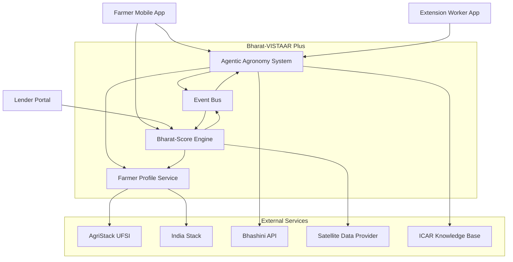

# Design Document: Bharat-VISTAAR Plus Integration

## Overview

The Bharat-VISTAAR Plus integration connects an AI-powered agronomic advisory system with a credit scoring engine to create a bidirectional feedback loop that improves both farming outcomes and financial inclusion for Indian farmers. This design specifies the architecture, components, interfaces, and data models for integrating the Agentic Agronomy System with the Bharat-Score Engine.

### Key Design Principles

1. **Unified Data Model**: A single Farmer Profile serves as the source of truth for both agronomic and financial systems
2. **Event-Driven Integration**: Compliance events and score updates flow asynchronously through an event bus
3. **Offline-First Architecture**: Critical functionality works without connectivity using local caching and edge inference
4. **DPI-Native Design**: Deep integration with AgriStack and India Stack as primary data sources
5. **Cost-Aware Intelligence**: Credit tier influences recommendation generation at the advisory layer
6. **Satellite Ground Truth**: NDVI data validates both agronomic effectiveness and creditworthiness

### Technology Stack

- **AI Foundation**: Amazon Bedrock (Claude 4.5 Sonnet/4.6) for reasoning and dialogue
- **Knowledge Layer**: Amazon Bedrock Knowledge Bases for RAG over ICAR documents
- **Multimodal Processing**: Bedrock Data Automation for crop images and receipts
- **Satellite Analytics**: Amazon SageMaker for NDVI time-series processing
- **Event Bus**: Amazon EventBridge for asynchronous integration
- **Data Store**: Amazon DynamoDB for Farmer Profiles, Amazon S3 for satellite imagery
- **Offline Layer**: SQLite + AWS IoT Greengrass for edge caching and inference
- **Multilingual**: Bhashini API for Indic language translation and synthesis
- **DPI Integration**: AgriStack UFSI, India Stack (Aadhaar, Account Aggregator)

## Architecture

### System Context Diagram



### Integration Flow

The integration operates through three primary flows:

**1. Compliance-to-Credit Flow**
- Farmer receives Advisory Action from Agentic Agronomy System
- Farmer confirms execution through mobile app
- Compliance Event published to Event Bus
- Bharat-Score Engine consumes event and recalculates credit score
- Updated Credit Tier stored in Farmer Profile

**2. Credit-to-Advisory Flow**
- Agentic Agronomy System generates recommendation
- System retrieves Credit Tier from Farmer Profile
- Recommendation filtered/adjusted based on affordability
- Cost-optimized alternatives generated for low-credit farmers
- Advisory Action delivered with financial context

**3. Satellite Validation Flow**
- SageMaker processes NDVI imagery for farmer plots
- NDVI Score stored in Farmer Profile with timestamp
- Bharat-Score Engine retrieves NDVI trends for credit calculation
- Agentic Agronomy System uses NDVI to validate advice effectiveness
- Field health improvement triggers credit score adjustment

## Components and Interfaces

### 1. Farmer Profile Service

**Responsibility**: Maintain unified farmer data across agronomic and financial domains

**Key Operations**:
- `createProfile(farmerId, aadhaarToken, landRecords) -> FarmerProfile`
- `getProfile(farmerId) -> FarmerProfile`
- `updateCreditTier(farmerId, newTier, score, timestamp) -> void`
- `recordAdvisoryAction(farmerId, action, timestamp) -> void`
- `recordComplianceEvent(farmerId, actionId, status, timestamp) -> void`
- `storeNDVIScore(farmerId, plotId, ndviValue, date) -> void`
- `getComplianceRate(farmerId, periodMonths) -> float`

**External Dependencies**:
- AgriStack UFSI for Farmer ID and land records
- India Stack for Aadhaar authentication
- DynamoDB for profile storage
- EventBridge for change notifications

**Data Encryption**: All PII fields encrypted with AES-256 using AWS KMS

### 2. Agentic Agronomy System

**Responsibility**: Generate proactive farming recommendations grounded in ICAR research

**Key Operations**:
- `generateAdvisoryAction(farmerId, context) -> AdvisoryAction`
- `identifyPest(farmerId, imageData) -> PestIdentification`
- `getTreatmentRecommendations(pestId, creditTier) -> List<Treatment>`
- `generateWeatherAlert(farmerId, weatherData) -> AdvisoryAction`
- `generateMarketAlert(farmerId, priceData) -> AdvisoryAction`
- `optimizeForCost(action, creditTier) -> CostOptimizedAlternative`

**External Dependencies**:
- Amazon Bedrock (Claude 4.5+) for reasoning
- Bedrock Knowledge Bases for ICAR RAG
- Bedrock Data Automation for image processing
- Bhashini API for multilingual voice
- Farmer Profile Service for credit tier
- EventBridge for compliance events

**Reasoning Pipeline**:
1. Retrieve farmer context (crop, location, credit tier, history)
2. Query ICAR Knowledge Base for relevant practices
3. Generate recommendation using Bedrock Claude
4. Filter by affordability based on credit tier
5. Synthesize voice response in farmer's language

### 3. Bharat-Score Engine

**Responsibility**: Calculate farmer creditworthiness using satellite, behavioral, and financial data

**Key Operations**:
- `calculateCreditScore(farmerId) -> CreditScore`
- `processComplianceEvent(farmerId, event) -> void`
- `processNDVIUpdate(farmerId, plotId, ndviScore) -> void`
- `generateCreditReport(farmerId) -> CreditReport`
- `getImprovementRecommendations(farmerId) -> List<Recommendation>`
- `classifyCreditTier(score) -> CreditTier`

**External Dependencies**:
- Amazon SageMaker for NDVI processing
- Satellite data provider (Sentinel-2/Landsat)
- India Stack Account Aggregator for financial data
- Farmer Profile Service for compliance and NDVI data
- EventBridge for score update notifications

**Scoring Algorithm**:
```
CreditScore = (NDVI_Component * 0.30) + 
              (Compliance_Component * 0.25) + 
              (Financial_Component * 0.45)

NDVI_Component = f(multi_temporal_field_health_trend)
Compliance_Component = f(advisory_completion_rate, timeliness)
Financial_Component = f(UPI_transactions, loan_repayment_history)

CreditTier = Low (300-500), Medium (501-700), High (701-900)
```

### 4. Event Bus (Amazon EventBridge)

**Responsibility**: Asynchronous communication between Advisory and Credit systems

**Event Types**:
- `ComplianceEvent`: Published when farmer completes/misses advisory action
- `CreditScoreUpdated`: Published when Bharat-Score recalculates score
- `NDVIScoreAvailable`: Published when new satellite data processed
- `AdvisoryActionIssued`: Published when new recommendation generated

**Event Schema Example**:
```json
{
  "eventType": "ComplianceEvent",
  "farmerId": "FID-12345678",
  "actionId": "ADV-2024-001",
  "status": "completed",
  "timestamp": "2024-01-15T10:30:00Z",
  "delayDays": 0
}
```

### 5. Offline Cache (SQLite + AWS IoT Greengrass)

**Responsibility**: Enable core functionality in zero-connectivity rural zones

**Cached Data**:
- Farmer Profile (last synced version)
- Recent Advisory Actions
- ICAR knowledge snippets for common queries
- Bhashini language models for basic voice
- Pending Compliance Events (for upload on reconnection)

**Sync Strategy**:
- Pull: Download profile updates every 6 hours when connected
- Push: Upload pending events within 60 seconds of reconnection
- Conflict Resolution: Server timestamp wins for profile updates

## Data Models

### FarmerProfile

```typescript
interface FarmerProfile {
  farmerId: string;              // Primary key from AgriStack
  aadhaarHash: string;           // Encrypted Aadhaar identifier
  personalInfo: {
    name: string;                // Encrypted
    phone: string;               // Encrypted
    preferredLanguage: string;   // ISO 639-1 code
    location: GeoCoordinates;
  };
  landRecords: LandRecord[];     // From AgriStack
  creditInfo: {
    currentScore: number;        // 300-900
    currentTier: CreditTier;     // Low, Medium, High
    lastUpdated: timestamp;
    scoreHistory: ScoreSnapshot[];
  };
  agronomicInfo: {
    currentCrop: string;
    sowingDate: timestamp;
    advisoryActions: AdvisoryAction[];
    complianceEvents: ComplianceEvent[];
    complianceRate6Month: float; // 0.0-1.0
  };
  ndviData: {
    plotScores: Map<plotId, NDVITimeSeries>;
    lastUpdated: timestamp;
  };
  createdAt: timestamp;
  lastSyncedAt: timestamp;
}
```

### AdvisoryAction

```typescript
interface AdvisoryAction {
  actionId: string;
  farmerId: string;
  actionType: "fertilizer" | "pesticide" | "irrigation" | "harvest" | "market";
  recommendation: string;        // Human-readable advice
  parameters: {
    inputName?: string;
    quantity?: number;
    unit?: string;
    timing?: timestamp;
    estimatedCost?: number;      // In INR
  };
  costOptimizedAlternative?: {
    recommendation: string;
    costDifference: number;
    yieldImpact: string;
    subsidyEligibility: string[];
  };
  icarSource: {
    documentId: string;
    pageNumber: number;
    citation: string;
  };
  issuedAt: timestamp;
  deadline?: timestamp;
  status: "pending" | "completed" | "missed";
}
```

### ComplianceEvent

```typescript
interface ComplianceEvent {
  eventId: string;
  farmerId: string;
  actionId: string;
  status: "completed" | "missed";
  executionTimestamp?: timestamp;
  delayDays: number;             // 0 if on-time, positive if late
  verificationMethod: "self_reported" | "satellite_validated";
  createdAt: timestamp;
}
```

### CreditScore

```typescript
interface CreditScore {
  farmerId: string;
  score: number;                 // 300-900
  tier: CreditTier;
  components: {
    ndviScore: number;           // 0-270 (30% weight)
    complianceScore: number;     // 0-225 (25% weight)
    financialScore: number;      // 0-405 (45% weight)
  };
  contributingFactors: {
    ndviTrend: "improving" | "stable" | "declining";
    complianceRate: float;
    recentComplianceEvents: number;
    upiTransactionVolume: number;
    loanRepaymentHistory: "good" | "fair" | "poor";
  };
  calculatedAt: timestamp;
  validUntil: timestamp;         // Score expires after 30 days
}
```

### NDVITimeSeries

```typescript
interface NDVITimeSeries {
  plotId: string;
  farmerId: string;
  measurements: NDVIMeasurement[];
  trend: "improving" | "stable" | "declining";
  lastProcessedAt: timestamp;
}

interface NDVIMeasurement {
  date: timestamp;
  ndviValue: float;              // -1.0 to 1.0
  satelliteSource: "Sentinel-2" | "Landsat-8";
  cloudCover: float;             // 0.0-1.0
  confidence: float;             // 0.0-1.0
}
```

### CreditReport

```typescript
interface CreditReport {
  farmerId: string;
  generatedAt: timestamp;
  currentScore: number;
  currentTier: CreditTier;
  scoreBreakdown: {
    ndviContribution: number;
    complianceContribution: number;
    financialContribution: number;
  };
  trends: {
    scoreChange30Days: number;
    scoreChange90Days: number;
    ndviTrend: string;
    complianceTrend: string;
  };
  improvementRecommendations: string[];
  loanEligibility: {
    maxLoanAmount: number;       // In INR
    estimatedInterestRate: float;
    recommendedLenders: string[];
  };
}
```


## Correctness Properties

A property is a characteristic or behavior that should hold true across all valid executions of a system—essentially, a formal statement about what the system should do. Properties serve as the bridge between human-readable specifications and machine-verifiable correctness guarantees.

### Property 1: Profile Data Integrity

*For any* farmer registration or data update (advisory action, NDVI score, credit score), the Farmer Profile should correctly store all required fields with proper timestamps and maintain referential integrity between related entities.

**Validates: Requirements 1.1, 1.2, 1.4**

### Property 2: PII Encryption Invariant

*For any* Farmer Profile stored in the database, all Personally Identifiable Information fields (name, phone, aadhaarHash) should be encrypted using AES-256, and decryption should yield the original values (round-trip property).

**Validates: Requirements 1.5, 12.1**

### Property 3: Compliance Event Generation

*For any* advisory action, when a farmer confirms execution or when a deadline passes, a Compliance Event should be created with the correct status ("completed" or "missed"), timestamp, and delay calculation.

**Validates: Requirements 2.1, 2.2, 5.4**

### Property 4: Compliance Rate Calculation

*For any* set of advisory actions over a 6-month period, the compliance rate should equal the ratio of completed actions to total actions, and this rate should be a value between 0.0 and 1.0.

**Validates: Requirements 2.4**

### Property 5: Compliance-Based Score Adjustments

*For any* farmer with a calculated compliance rate, if the rate exceeds 80%, the credit score adjustment should be positive (5-10 points), and if the rate falls below 40%, the adjustment should be negative (5-15 points).

**Validates: Requirements 2.5, 2.6**

### Property 6: Credit Score Bounds and Composition

*For any* credit score calculation, the final score should be between 300-900, and the score should equal the weighted sum of NDVI component (30%), compliance component (25%), and financial component (45%).

**Validates: Requirements 3.6**

### Property 7: NDVI-Driven Credit Tier Adjustments

*For any* farmer with NDVI time series data, if field health improves consistently over 3 crop cycles, the Credit Tier should increase by one level, and if field health declines over 2 crop cycles, the Credit Tier should decrease by one level.

**Validates: Requirements 3.2, 3.3**

### Property 8: Fallback Scoring Without Satellite Data

*For any* farmer without recent NDVI data (past 30 days), the credit score calculation should still produce a valid score (300-900) using only compliance rate and financial history components.

**Validates: Requirements 3.5**

### Property 9: Cost-Aware Recommendation Generation

*For any* advisory action generated for a farmer with Credit Tier "Low" where the estimated cost exceeds ₹2000, the system should generate a Cost_Optimized_Alternative containing cost difference, yield impact, and subsidy eligibility information.

**Validates: Requirements 4.2, 4.3**

### Property 10: Credit Tier Influences Recommendation Content

*For any* advisory action, the recommendation content should reflect the farmer's Credit Tier: Low tier should prioritize organic/low-cost options with government scheme links, Medium/High tier should include premium options with ROI calculations.

**Validates: Requirements 4.4, 4.5, 4.6**

### Property 11: Treatment Affordability Filtering

*For any* pest identification and treatment recommendation, the system should retrieve the farmer's Credit Tier and filter treatment options to include only those within the farmer's affordability range.

**Validates: Requirements 5.3**

### Property 12: Field Recovery Score Boost

*For any* farmer who executes a pest treatment recommendation, if subsequent NDVI data shows field health improvement, the credit score should receive a positive adjustment of 3-7 points.

**Validates: Requirements 5.5**

### Property 13: Weather-Triggered Advisory Generation

*For any* farmer with hyperlocal weather data indicating heavy rainfall within 48 hours, the system should generate an Advisory Action recommending postponement of fertilizer application.

**Validates: Requirements 6.1**

### Property 14: Market Volatility Advisory Generation

*For any* farmer whose primary crop experiences price volatility exceeding 15%, the system should generate an Advisory Action with selling recommendations.

**Validates: Requirements 6.2**

### Property 15: Credit-Aware Financial Hedging

*For any* weather or market advisory action generated for a farmer with Credit Tier "Medium" or "High", the recommendation should include financial hedging options.

**Validates: Requirements 6.3**

### Property 16: Weather Compliance Score Boost

*For any* farmer who follows a weather-related advisory action, the credit score should receive a positive adjustment of 5-10 points.

**Validates: Requirements 6.5**

### Property 17: Significant Score Change Notifications

*For any* credit score update where the score changes by more than 20 points, the system should send a notification to the farmer explaining the primary contributing factors.

**Validates: Requirements 7.1**

### Property 18: Credit Report Completeness

*For any* credit report generated for a farmer, the report should contain all required sections: current score, current tier, score breakdown (NDVI 30%, compliance 25%, financial 45%), trends, and improvement recommendations.

**Validates: Requirements 7.2, 7.3**

### Property 19: High Compliance Achievement Notifications

*For any* farmer who achieves 90% compliance rate for 3 consecutive months, the system should send a congratulatory notification with improved loan eligibility information.

**Validates: Requirements 7.4**

### Property 20: Actionable Credit Improvement Recommendations

*For any* credit report, the improvement recommendations should be specific and actionable (e.g., "Complete 3 more advisory actions this month"), not vague suggestions.

**Validates: Requirements 7.5**

### Property 21: Multilingual Notification Delivery

*For any* credit notification or advisory action, the system should deliver the message in the farmer's preferred language using Bhashini Service, and the language should match the farmer's profile setting.

**Validates: Requirements 7.6, 10.5**

### Property 22: Crop Validation Against Registry

*For any* farmer-reported crop type and sowing date, the system should validate the information against the AgriStack Crop Sown Registry and flag discrepancies.

**Validates: Requirements 8.4**

### Property 23: DPI Interaction Audit Logging

*For any* interaction with AgriStack or India Stack services, the system should create an audit log entry containing timestamp, service name, operation, and response code.

**Validates: Requirements 8.6**

### Property 24: ICAR Knowledge Base Grounding

*For any* advisory action or treatment recommendation, the system should retrieve relevant context from the ICAR Knowledge Base and include a citation with document ID and page number.

**Validates: Requirements 9.1, 9.3**

### Property 25: Knowledge Gap Escalation

*For any* farmer query where the ICAR Knowledge Base does not contain relevant information, the system should notify the farmer and create an escalation ticket for a human extension worker.

**Validates: Requirements 9.5**

### Property 26: Multilingual Voice Support

*For any* voice interaction, the system should support input and output in all 12 configured Indian languages, and the language should be selectable by the farmer.

**Validates: Requirements 10.1**

### Property 27: Voice Command Compliance Confirmation

*For any* voice command matching the pattern "I applied [action] today" or similar compliance confirmation phrases, the system should create a Compliance Event with status "completed".

**Validates: Requirements 10.4**

### Property 28: Consent-Based Financial Data Access

*For any* request to access farmer financial data through the Account Aggregator framework, the system should obtain explicit farmer consent, log the consent timestamp, and only proceed if consent is granted.

**Validates: Requirements 12.3**

### Property 29: Role-Based Access Control

*For any* system operation, the user's role (farmer, extension worker, lender, administrator) should determine which operations are permitted, and unauthorized operations should be rejected.

**Validates: Requirements 12.4**

### Property 30: PII Deletion with Analytics Retention

*For any* farmer data deletion request, the system should remove all Personally Identifiable Information while retaining anonymized analytics data (e.g., aggregated crop yields, regional trends).

**Validates: Requirements 12.6**

## Error Handling

### Error Categories

**1. External Service Failures**
- AgriStack/India Stack unavailable: Fall back to Offline Cache, queue operations for retry
- Bhashini API failure: Fall back to text-only interface, log error for monitoring
- Satellite data provider timeout: Use cached NDVI data, mark score as "stale"
- Bedrock service throttling: Implement exponential backoff, queue requests

**2. Data Validation Errors**
- Invalid Farmer ID: Return 404 with clear error message
- Malformed NDVI data: Log error, skip measurement, continue processing
- Missing required profile fields: Return 400 with list of missing fields
- Credit score out of bounds: Clamp to 300-900 range, log warning

**3. Business Logic Errors**
- Compliance rate calculation with zero actions: Return 0.0 as default
- Credit tier calculation with insufficient data: Assign "Low" tier, flag for review
- Advisory generation with unknown crop: Query ICAR KB for similar crops, escalate if no match
- Cost optimization with missing price data: Skip alternative generation, log warning

**4. Security Errors**
- Unauthorized access attempt: Return 403, log security event
- Consent not granted for financial data: Return 403, prompt for consent
- Encryption key unavailable: Fail operation, alert administrators
- Invalid Aadhaar token: Return 401, prompt re-authentication

### Error Response Format

```typescript
interface ErrorResponse {
  errorCode: string;           // Machine-readable code
  errorMessage: string;        // Human-readable message in farmer's language
  errorDetails?: object;       // Additional context for debugging
  retryable: boolean;          // Whether client should retry
  fallbackAction?: string;     // Suggested alternative action
  timestamp: timestamp;
}
```

### Retry and Circuit Breaker Policies

- **Transient failures**: Exponential backoff (1s, 2s, 4s, 8s, 16s max)
- **Circuit breaker**: Open after 5 consecutive failures, half-open after 60s
- **Timeout values**: API calls 10s, satellite processing 300s, DB queries 5s
- **Dead letter queue**: Failed events retained for 7 days for manual review

## Testing Strategy

### Dual Testing Approach

The system requires both unit testing and property-based testing for comprehensive coverage:

**Unit Tests**: Verify specific examples, edge cases, and error conditions
- Specific farmer profile creation scenarios
- Edge cases like empty compliance history, missing NDVI data
- Error conditions like service failures, invalid inputs
- Integration points between components

**Property Tests**: Verify universal properties across all inputs
- Generate random farmer profiles, advisory actions, NDVI time series
- Verify properties hold for all generated inputs (minimum 100 iterations)
- Catch edge cases that unit tests might miss
- Validate mathematical invariants (score bounds, rate calculations)

### Property-Based Testing Configuration

**Testing Library**: Use `fast-check` for TypeScript/JavaScript or `Hypothesis` for Python

**Test Configuration**:
- Minimum 100 iterations per property test
- Seed randomization for reproducibility
- Shrinking enabled to find minimal failing examples

**Test Tagging**: Each property test must reference its design document property
- Format: `// Feature: bharat-vistaar-integration, Property 1: Profile Data Integrity`

**Generator Strategy**:
- `FarmerProfile`: Generate valid Farmer IDs, random crops, realistic NDVI values
- `AdvisoryAction`: Generate various action types, costs, deadlines
- `ComplianceEvent`: Generate completed/missed status, realistic delays
- `NDVITimeSeries`: Generate improving/stable/declining trends over multiple cycles
- `CreditScore`: Generate scores within 300-900 range with valid component weights

### Example Property Test Structure

```typescript
// Feature: bharat-vistaar-integration, Property 6: Credit Score Bounds and Composition
test('credit score is within bounds and correctly weighted', () => {
  fc.assert(
    fc.property(
      fc.record({
        ndviComponent: fc.float({ min: 0, max: 270 }),
        complianceComponent: fc.float({ min: 0, max: 225 }),
        financialComponent: fc.float({ min: 0, max: 405 })
      }),
      (components) => {
        const score = calculateCreditScore(components);
        
        // Score should be within bounds
        expect(score).toBeGreaterThanOrEqual(300);
        expect(score).toBeLessThanOrEqual(900);
        
        // Score should equal weighted sum
        const expectedScore = 
          components.ndviComponent + 
          components.complianceComponent + 
          components.financialComponent;
        expect(score).toBeCloseTo(expectedScore, 2);
      }
    ),
    { numRuns: 100 }
  );
});
```

### Integration Testing

**Critical Integration Points**:
- AgriStack UFSI authentication and data retrieval
- India Stack Account Aggregator consent flow
- Bhashini API multilingual translation
- Bedrock Knowledge Bases RAG queries
- SageMaker NDVI processing pipeline
- EventBridge event delivery and consumption

**Integration Test Approach**:
- Use test doubles for external services during development
- Run integration tests against staging environments
- Validate end-to-end flows: registration → advisory → compliance → score update
- Test offline-to-online synchronization scenarios

### Performance Testing

**Load Testing Scenarios**:
- 10,000 concurrent credit score calculations
- 1 million NDVI plot processing within 24 hours
- 95th percentile latency under 500ms for advisory generation

**Performance Test Tools**:
- Apache JMeter or Gatling for load testing
- AWS CloudWatch for latency monitoring
- Custom scripts for NDVI processing throughput

### Security Testing

**Security Test Coverage**:
- Verify PII encryption at rest (Property 2)
- Validate TLS 1.3 for data in transit
- Test RBAC with different user roles (Property 29)
- Verify consent enforcement for financial data (Property 28)
- Test data deletion compliance (Property 30)

**Security Testing Tools**:
- OWASP ZAP for vulnerability scanning
- AWS IAM Policy Simulator for permission testing
- Custom scripts for encryption verification
